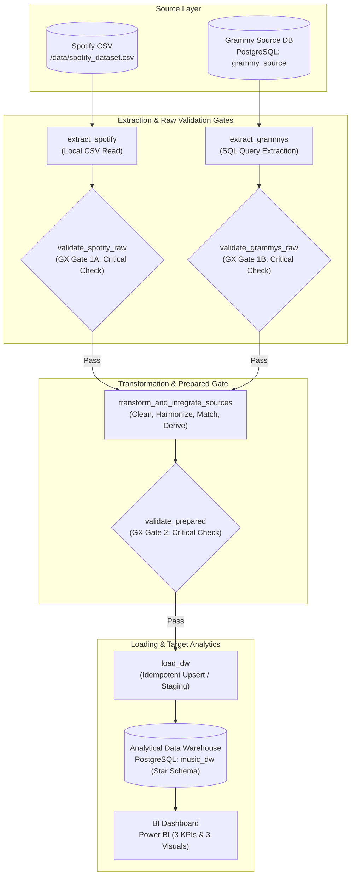
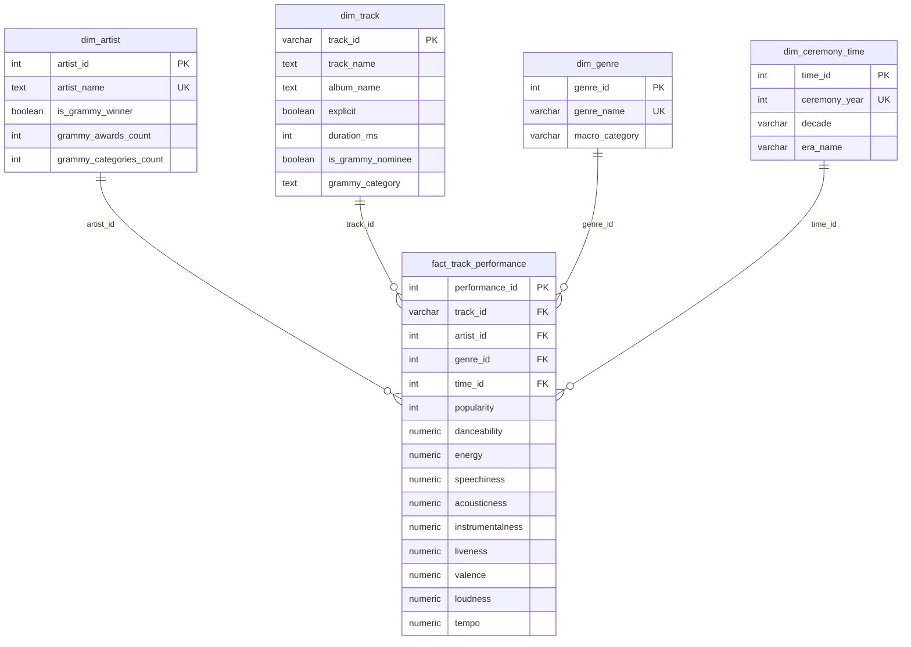
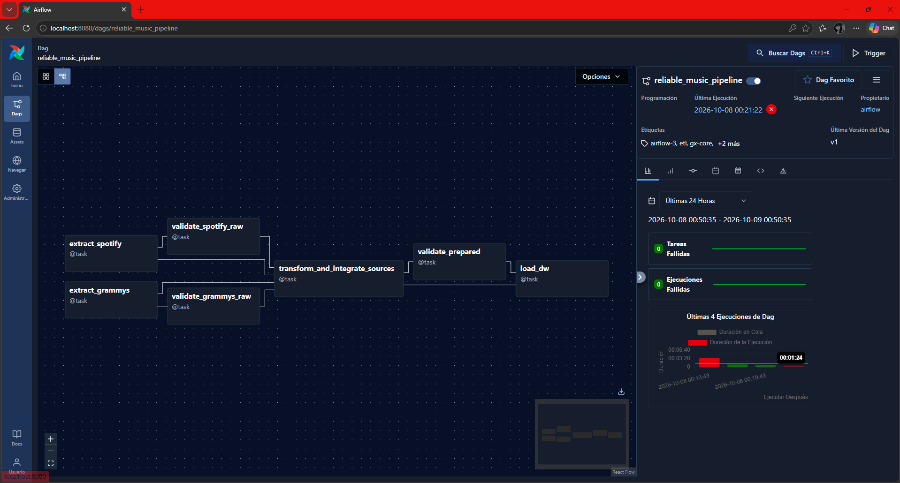
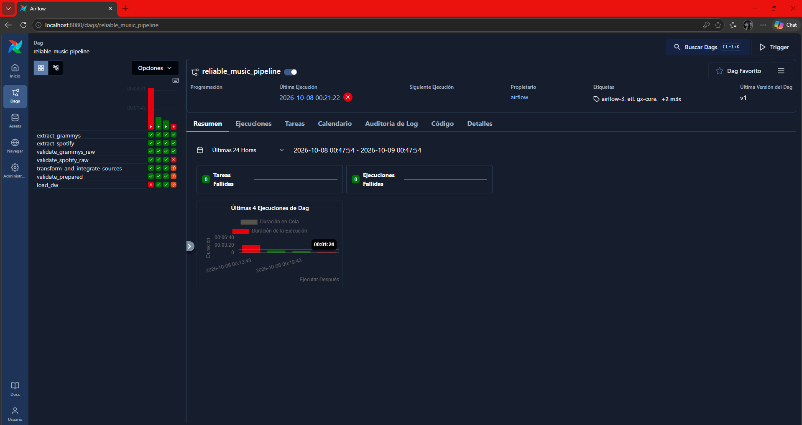
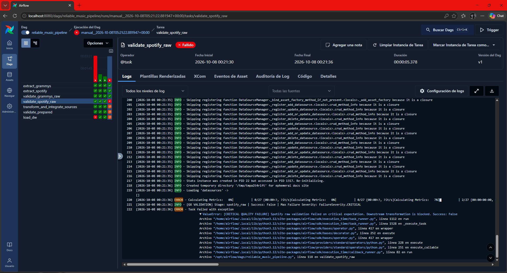
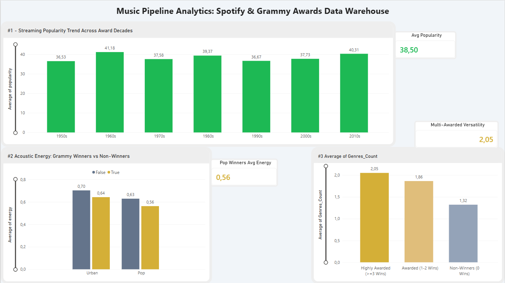
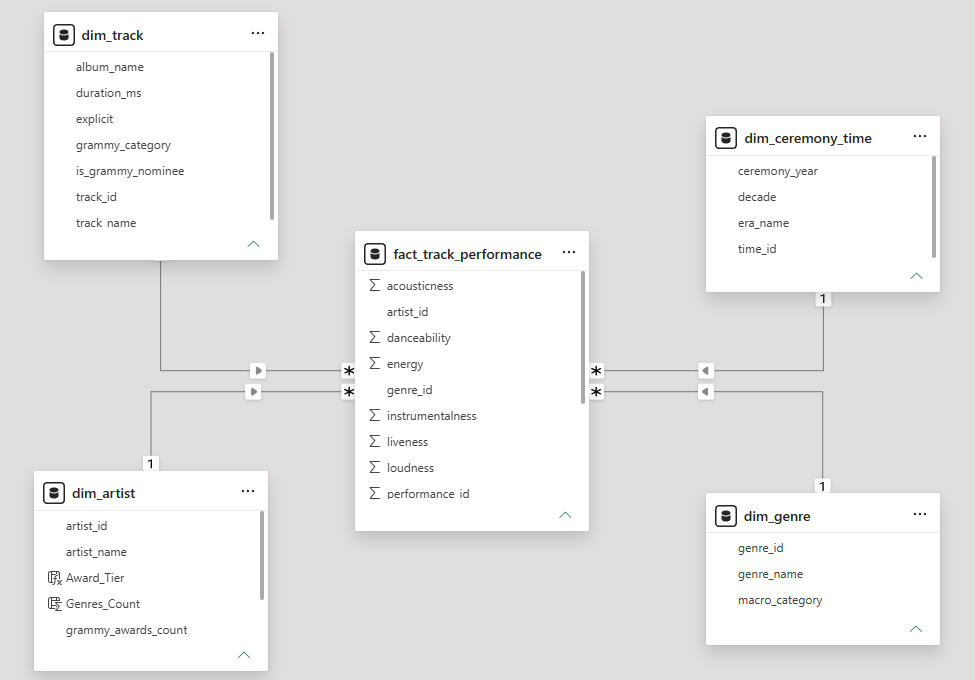

# Workshop 2: Building a Reliable Batch Data Pipeline


---

## 1. Problem and Analytical Objective
Modern music streaming platforms manage vast catalogs of audio tracks and dynamic consumption metrics. However, determining which catalog acquisitions and artist curation strategies maximize long-term business value requires crossing streaming consumption data with historical industry accolades. 

This engineering system integrates two heterogeneous data sources:
1. **Spotify Streaming Catalog** (CSV format, ~114,000 tracks).
2. **The Grammy Awards Repository** (Operational Relational Database in PostgreSQL, 4,810 records).

The pipeline produces a trusted, dimensional **Data Warehouse (Star Schema)** to support catalog investment, acoustic curation, and artist versatility analytics.

---

## 2. Analytical Requirements and Scope

| ID | Analytical Question & Decision Supported | Required Data & Sources | Expected Metric / KPI | Required Grain | Justification for Source Crossing |
| :--- | :--- | :--- | :--- | :--- | :--- |
| **REQ-01** | **Temporal Evolution of Historical Winners' Commercial Success:** How is current streaming popularity distributed across Grammy ceremony decades? Supports licensing and catalog curation. | `the_grammy_awards.year`, `nominee`, `winner`, `spotify_dataset.track_name`, `popularity` | **AVG(popularity)** by ceremony decade | Ceremony Decade $\times$ Song | Award ceremonies only exist in Grammys; streaming consumption only exists in Spotify. |
| **REQ-02** | **Acoustic Behavior in Pop and Urban Genres:** What acoustic gap (energy, speechiness) exists between Grammy-winning artists vs non-winners? Supports sound engineering and editorial curation. | `the_grammy_awards.artist`, `winner`, `spotify_dataset.artists`, `track_genre`, `speechiness`, `energy` | **Acoustic Gap:** $\text{AVG}(energy)_{\text{winner}} - \text{AVG}(energy)_{\text{non-winner}}$ | Genre $\times$ Artist | Spotify extracts algorithmic acoustic traits; Grammys determines historical award status. |
| **REQ-03** | **Genre Diversity in Multi-Awarded Artists:** Do artists who win across multiple categories explore more genres in Spotify? Supports artist sponsorship and talent scouting. | `the_grammy_awards.artist`, `category`, `winner`, `spotify_dataset.artists`, `track_genre` | **AVG(COUNT(DISTINCT track_genre))** comparing $\ge 3$ awards vs 1 award vs non-winners | Artist | Award counts originate from Grammys; genre exploration mappings originate from Spotify. |

---

## 3. Data Sources

1. **Spotify Dataset (`data/spotify_dataset.csv`):** 114,000 observations containing natural key `track_id`, comma/semicolon delimited `artists`, `album_name`, `track_name`, integer `popularity` (0–100), and algorithmic acoustic features (`energy`, `speechiness`, `danceability`, `acousticness`, `tempo`, `track_genre`).
2. **Grammy Awards Database (`grammy_source.the_grammy_awards`):** Relational operational table pre-populated in PostgreSQL via `sql/source_setup.sql`. Contains 4,810 records spanning 1958–2019, documenting `year`, `title`, `category`, `nominee`, `artist`, `workers`, and `winner`. Extracted strictly via SQL queries, never directly from raw CSV files.

---

## 4. Pipeline Architecture



---

## 5. Data Profiling Findings

Empirical findings gathered via `notebooks/data_profiling.ipynb`:
* **Spotify Dataset Structure & Grain:** 114,000 total rows. Distinct `track_id` count is 89,741. There are 24,259 duplicated `track_id` records because tracks are categorized under multiple `track_genre` values. Composite natural key at the source grain is `(track_id, track_genre)` (0 duplicates).
* **Completeness:** Exactly 1 record in Spotify has missing `artists`, `album_name`, and `track_name` (99.999% completeness). In Grammys, `artist` is null in 1,840 records (symphonies, producers, packaging categories where `nominee` contains the title).
* **Numerical Bounds:** `popularity` ranges from 0 to 100. `energy` and `speechiness` range strictly between 0.0 and 1.0 (mean energy = 0.641, mean speechiness = 0.084).
* **Temporal Range:** Grammys range from 1958 to 2019 across 62 ceremonies.
* **Cross-Source Consistency:** Direct string matching yields 408 exact artist matches and 706 exact song title matches, significantly expanded after normalization (lowercasing, trimming, semicolon splitting).

---

## 6. Quality Risks and Quality Rules

| Rule ID | Layer | Attribute(s) | Quality Dimension | Quality Rule Statement | Metric / Threshold | Severity | Related Requirement |
| :--- | :--- | :--- | :--- | :--- | :--- | :--- | :--- |
| **DQ-RAW-01** | Spotify Raw | `track_id` | Completeness & Uniqueness | Track identifier must be non-null | 100% non-null (`mostly=1.0`) | **Critical** | All (Grain integrity) |
| **DQ-RAW-02a** | Spotify Raw | `energy` | Validity & Range | Energy must be normalized ratio within [0.0, 1.0] | 100% within [0.0, 1.0] | **Critical** | REQ-02 (Acoustic gap) |
| **DQ-RAW-02b** | Spotify Raw | `speechiness` | Validity & Range | Speechiness must be normalized ratio within [0.0, 1.0] | 100% within [0.0, 1.0] | **Critical** | REQ-02 (Acoustic gap) |
| **DQ-RAW-03** | Spotify Raw | `artists` | Completeness | Artist string must not be missing | $\ge 99.9\%$ non-null (`mostly=0.999`) | **Warning** | REQ-02, REQ-03 |
| **DQ-RAW-04** | Grammys Raw | `year` | Validity & Range | Ceremony year must be between 1958 and 2026 | 100% within [1958, 2026] | **Critical** | REQ-01 (Temporal trends) |
| **DQ-RAW-05** | Grammys Raw | `winner` | Validity & Consistency | Winner flag must be boolean | 100% in {True, False} | **Critical** | REQ-01, REQ-02, REQ-03 |
| **DQ-PREP-01** | Prepared | `track_genre`, `popularity` | Completeness & Validity | Genre must be present; popularity in [0, 100] | 100% valid | **Critical** | REQ-01, REQ-02 |
| **DQ-PREP-02** | Prepared | `is_grammy_winner` | Validity & Invariant | Derived winner flag must be binary integer | 100% in {0, 1} | **Critical** | REQ-02, REQ-03 |

---

## 7. Great Expectations Validation Design
Implemented in `src/validation.py` and persisted in `gx/` using **Great Expectations Core 1.x (1.24.x Fluent API)**:
* **Persisted Project Structure:** 
  * `gx/great_expectations.yml`: Data context configuration.
  * `gx/expectations/`: Stores machine-readable JSON suites (`spotify_raw_suite.json`, `grammys_raw_suite.json`, `prepared_suite.json`).
  * `gx/validation_definitions/`: Stores explicit bindings between batch definitions and suites (`spotify_raw_validation.json`, etc.).
* **Execution Flow:** `context.data_sources.add_pandas()` $\rightarrow$ `add_dataframe_asset()` $\rightarrow$ `add_batch_definition_whole_dataframe()` $\rightarrow$ `ValidationDefinition.run()`.
* **Severity Enforcement:**
  * `FailureSeverity.CRITICAL`: Triggers explicit `ValueError`, raising an exception that causes Airflow to fail the task and mark downstream tasks as `upstream_failed`.
  * `FailureSeverity.WARNING`: Emits structured log notices while allowing pipeline continuation per policy.

---

## 8. Transformation and Integration Strategy

```
Integration Contract:
- Primary Domain: Spotify Tracks (114,000 observations).
- Accolade Dimension: Historical Grammy Awards.
- Artist Match Key: Normalized primary artist name (lowercase, stripped, unnested from semicolon list).
- Cardinality: Many tracks to One artist (Many-to-One); One artist to Many Grammy wins (One-to-Many).
- Unmatched Records: Preserved in Spotify catalog with is_grammy_winner = 0 and awards_count = 0.
- Deduplication Invariant: Unique composite key enforced at (track_id, track_genre).
```

Derived Attributes:
* `macro_category`: Maps genres to `'Pop'` (`pop`, `dance-pop`, `k-pop`, etc.), `'Urban'` (`hip-hop`, `r-n-b`, `reggaeton`, `rap`, etc.), or `'Other'`.
* `decade` & `era_name`: Decennial buckets (`1960s`, `1970s`, ..., `2010s`) and eras (`Classic Era`, `Golden Era`, `Digital Transition`, `Streaming Era`).

---

## 9. Dimensional Model (Star Schema)

The analytical data warehouse `music_dw` is structured as a star schema optimized for fast OLAP aggregations:



---

## 10. Airflow DAG Design & Reliability Controls
The orchestration DAG `dags/reliable_music_pipeline.py` uses the official **TaskFlow API** (`from airflow.sdk import dag, task`) in **Apache Airflow 3.1.8**:
* **Inter-Task Interfaces:** Tasks pass lightweight strings containing file paths, avoiding orchestrator metadata saturation.
* **Validation Gates:** Upstream gates enforce execution dependency via bitshift operators:
  ```python
  [spot_val, gram_val] >> prep_data
  prep_val >> dw_load_step
  ```

### Failure and Retry Policy

| Task Name | Task Class | Configured Retries | Delay | Engineering Justification |
| :--- | :--- | :--- | :--- | :--- |
| `extract_spotify` | Deterministic File I/O | **0** | None | File absence or corruption is deterministic; retrying wastes execution slots. |
| `extract_grammys` | Database Query I/O | **2** | 10s | Guards against transient database network timeouts or pool saturation. |
| `validate_spotify_raw` | Data Quality Check | **0** | None | Rule violations are deterministic; retries reproduce identical failures. |
| `validate_grammys_raw` | Data Quality Check | **0** | None | Contract violations are deterministic; stop immediately. |
| `transform_and_integrate`| Deterministic Transform| **0** | None | Business transformations are deterministic. |
| `validate_prepared` | Data Quality Check | **0** | None | Prepared invariants are deterministic; stop before loading. |
| `load_dw` | Database Transaction | **2** | 10s | Transient locks or pool saturation are resolvable via bounded retries. |

---

## 11. Mandatory Reliability Tests & Evidence

### Test A: Successful End-to-End Execution
* **Run ID:** `manual__2026-10-08T05:17:53.571414+00:00`
* **Result:** All 7 tasks completed with `success`.
* **Execution Time:** 1 minute 3 seconds.
* **Log Evidence:** Preserved in `docs/evidence/test_a_successful_run.txt`.
* **Visual Evidence:**
  
  
* **Reconciled DW Counts:** `dim_genre: 114`, `dim_ceremony_time: 62`, `dim_artist: 17,648`, `dim_track: 89,740`, `fact_track_performance: 113,549`.

### Test B: Controlled Critical Quality Failure
* **Run ID:** `manual__2026-10-08T05:21:22.881947+00:00`
* **Trigger:** Corrupted dataset `spotify_bad.csv` with `energy = 15.0` (Rule `DQ-RAW-02a`).
* **Result:**
  * `extract_spotify`: `success`.
  * `validate_spotify_raw`: **`failed`** (`FailureSeverity.CRITICAL` detected).
  * `transform_and_integrate_sources`: **`upstream_failed`** (Blocked).
  * `validate_prepared`: **`upstream_failed`** (Blocked).
  * `load_dw`: **`upstream_failed`** (Blocked).
* **Log Evidence:** Preserved in `docs/evidence/test_b_controlled_failure.txt`.
* **Visual Evidence:**
  

### Test C: Safe Rerun & Idempotency
* **Run ID:** `manual__2026-10-08T05:19:43.308595+00:00`
* **Result:** Re-executed with identical input batch.
* **Pre vs Post Rerun Metrics:**
  * Fact Row Count: Exactly `113,549` before and after ($\Delta = 0$).
  * Total Popularity Sum: Exactly `3,783,956` before and after ($\Delta = 0$).
  * Average Energy: Exactly `0.6421` before and after ($\Delta = 0.0000$).
* **Mechanism:** Temporary staging tables with `ON CONFLICT (track_id, genre_id) DO UPDATE`.
* **Log Evidence:** Preserved in `docs/evidence/test_c_idempotent_rerun.txt`.

---

## 12. Dashboard and Analytical Outputs (Power BI)

All analytical visualizations query the PostgreSQL Data Warehouse directly via `sql/analytical_kpi_queries.sql`:

```sql
-- REQ-01: Historical Decade Popularity
SELECT t.decade, ROUND(AVG(f.popularity), 2) AS avg_popularity
FROM fact_track_performance f JOIN dim_ceremony_time t ON f.time_id = t.time_id
GROUP BY t.decade ORDER BY t.decade;

-- REQ-02: Acoustic Gap in Pop & Urban
SELECT g.macro_category, a.is_grammy_winner, ROUND(AVG(f.energy), 4) AS avg_energy
FROM fact_track_performance f JOIN dim_genre g ON f.genre_id = g.genre_id JOIN dim_artist a ON f.artist_id = a.artist_id
WHERE g.macro_category IN ('Pop', 'Urban') GROUP BY g.macro_category, a.is_grammy_winner;

-- REQ-03: Genre Exploration by Award Tier
SELECT CASE WHEN a.grammy_awards_count >= 3 THEN 'Highly Awarded' ELSE 'Other' END, AVG(sub.genre_count)
FROM dim_artist a JOIN (SELECT artist_id, COUNT(DISTINCT genre_id) AS genre_count FROM fact_track_performance GROUP BY artist_id) sub ON a.artist_id = sub.artist_id
GROUP BY 1;
```

### Empirical Results Produced by the DW:
1. **REQ-01 (Popularity by Decade):**
   * 1960s: **41.18** avg popularity.
   * 2010s: **40.31** avg popularity.
   * 1990s: **36.67** avg popularity.
2. **REQ-02 (Acoustic Gap in Pop & Urban):**
   * In **Pop**, Grammy winners exhibit **0.5627** average energy vs **0.6289** for non-winners ($\text{gap} = -0.0662$).
   * In **Urban**, Grammy winners exhibit **0.6426** average energy vs **0.7027** for non-winners ($\text{gap} = -0.0601$).
   * Conclusion: Academy recognition favors organic dynamic range over loudness-war saturation.
3. **REQ-03 (Genre Versatility):**
   * Highly Awarded Artists ($\ge 3$ wins): **2.05** distinct genres explored on average.
   * Awarded Artists (1–2 wins): **1.86** distinct genres explored.
   * Non-Winners (0 wins): **1.32** distinct genres explored.
   * Conclusion: Multi-awarded artists explore +55% more genres across their catalog.

### Dashboard & Dimensional Model Screenshots:



---

## 13. Power BI Configuration Step-by-Step

### Connecting Power BI to the Data Warehouse
1. Open **Power BI Desktop**.
2. Select **Get Data** $\rightarrow$ **More...** $\rightarrow$ **PostgreSQL database**.
3. Connection inputs:
   * **Server:** `localhost:5432`
   * **Database:** `music_dw`
   * **Data Connectivity mode:** DirectQuery or Import
4. Credentials:
   * **Username:** `postgres`
   * **Password:** `postgres`
5. Load all 5 warehouse tables: `dim_artist`, `dim_track`, `dim_genre`, `dim_ceremony_time`, `fact_track_performance`.

### Building the 3 Analytical Visuals & KPIs
* **Visual 1 (REQ-01):** Clustered Column Chart.
  * X-Axis: `dim_ceremony_time.decade` (Filtered to 1950s–2010s).
  * Y-Axis: `Average of popularity` (from `fact_track_performance`).
  * KPI Card: Overall Average Popularity of awarded catalog (`40.31`).
* **Visual 2 (REQ-02):** Clustered Bar Chart.
  * Y-Axis: `dim_genre.macro_category` (Filtered to `'Pop'` and `'Urban'`).
  * Legend: `dim_artist.is_grammy_winner`.
  * X-Axis: `Average of energy`.
  * KPI Card: Acoustic Energy Gap ($-0.0662$ in Pop; $-0.0601$ in Urban).
* **Visual 3 (REQ-03):** Column Chart.
  * Axis: Calculated Column for Award Tier (`>=3 Wins`, `1-2 Wins`, `0 Wins`).
  * Values: Average count of distinct `genre_id` per artist.
  * KPI Card: Versatility Ratio ($2.05$ vs $1.32$ genres explored).

---

## 14. Live Evaluation Demonstrations

### Demonstration 1: Successful End-to-End Execution (Test A)
1. Open browser at [http://localhost:8080](http://localhost:8080) (Credentials: `admin` / `admin`).
2. Show `reliable_music_pipeline` Grid and Graph views showing all tasks green.
3. Run verification query in PowerShell:
   ```powershell
   docker exec workshop2-postgres psql -U postgres -d music_dw -c "SELECT count(*) FROM fact_track_performance;"
   ```
   **Result:** Exactly `113,549` rows.

### Demonstration 2: Controlled Critical Failure & Blocking (Test B)
1. Trigger pipeline with corrupted data payload:
   ```powershell
   docker exec workshop2-airflow airflow dags trigger -c '{"spotify_file": "spotify_bad.csv"}' reliable_music_pipeline
   ```
2. Show `validate_spotify_raw` failing in red, while `transform_and_integrate_sources` and `load_dw` stay in orange (`upstream_failed`).
3. View task log showing Great Expectations catching `energy = 15.0`.

### Demonstration 3: Safe Rerun & Idempotency (Test C)
1. Trigger pipeline again over identical data:
   ```powershell
   docker exec workshop2-airflow airflow dags trigger reliable_music_pipeline
   ```
2. Show that row count remains strictly `113,549` and `SUM(popularity)` remains `3,783,956` ($\Delta = 0$).

---

## 15. Oral Defense Technical Q&A

### Q1: Why use TaskFlow API (`from airflow.sdk import dag, task`) instead of standard `PythonOperator`?
> *"The TaskFlow API is the modern standard of Apache Airflow 3. It eliminates boilerplate code, handles parameter passing cleanly, and communicates workflow dependencies explicitly without sending heavy DataFrames through orchestrator metadata."*

### Q2: How does the pipeline guarantee idempotency? What happens if `load_dw` fails midway?
> *"All loading operations run inside an atomic database transaction (`with engine.begin()`). If an error occurs, PostgreSQL automatically rolls back the entire batch. Furthermore, the load logic uses temporary staging tables and set-based upserts (`ON CONFLICT (track_id, genre_id) DO UPDATE`), guaranteeing that rerunning updates existing keys rather than duplicating rows."*

### Q3: Why is selective retrying used instead of a blanket `retries=3` on every task?
> *"Data quality contract violations are deterministic: retrying an invalid value 3 times produces the identical failure 3 times, wasting resources. Therefore, validation tasks use `retries=0`. In contrast, database network operations use `retries=2` to tolerate transient connection drops or temporary write locks."*

### Q4: Why use Great Expectations 1.x instead of basic Python assertions?
> *"Great Expectations provides formal, auditable data contracts. It produces structured validation statistics, tracks severities (Critical vs Warning), and generates auditable artifacts. Basic assertions halt execution without diagnostic context."*

### Q5: How is REQ-01 answered without duplicating track records for songs awarded multiple times?
> *"In our Star Schema, `dim_track` maintains one unique record per Spotify song. Historical ceremony context is normalized into `dim_ceremony_time`. The fact table `fact_track_performance` models each track performance by genre and links to the award ceremony time key, allowing analytical queries to aggregate popularity by decade without duplicating acoustic measurements."*

---

## 16. Setup and Execution Instructions

### Prerequisites
* Docker Desktop (running with WSL2 backend on Windows 11).
* Ports `8080` (Airflow) and `5432` (PostgreSQL) available.

### Quick Start Commands
```powershell
# 1. Clone the repository and configure environment
cp .env.example .env

# 2. Build and launch Docker services
docker compose up -d

# 3. Initialize Grammy operational relational database
Get-Content sql/source_setup.sql | docker exec -i workshop2-postgres psql -U postgres -d grammy_source

# 4. Open Airflow Web UI
# URL: http://localhost:8080 (Username: admin | Password: admin)

# 5. Trigger the production pipeline (Test A)
docker exec workshop2-airflow airflow dags trigger reliable_music_pipeline
```

---

## 17. Assumptions and Limitations
1. **Artist Matching Assumption:** Multi-artist collaborative tracks (e.g., `Ingrid Michaelson;ZAYN`) are credited to the primary lead artist for dimensional foreign key integrity.
2. **Streaming Popularity Timeliness:** Spotify popularity is an instantaneous rolling metric reflecting current listening activity, enabling comparative analysis of catalog longevity.
3. **Scope Limitation:** The Grammy dataset covers awards through 2019; contemporary tracks released after 2019 are evaluated under the non-awarded baseline.
